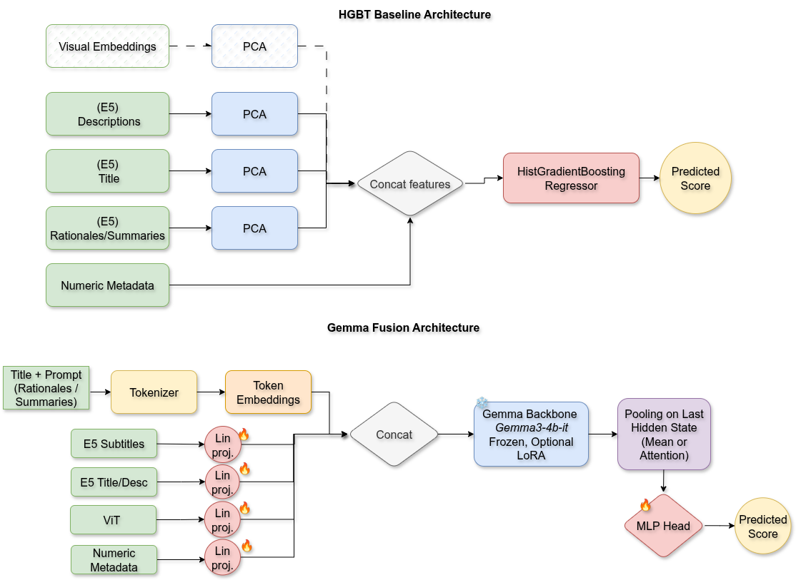

# MediaEval 2025: Predicting Movie and Commercial Memorability

## Competition overview

This repository hosts our solution for **MediaEval 2025 Subtask 2: Commercial Memorability**.  The task asks teams to
predict short-term memorability scores for advertising-style videos.  Organisers provide metadata, subtitles, derived
visual features, and split definitions for a development set (with ground truth) plus a held-out test set.  Submissions
are scored on Spearman correlation against the official annotations, with a focus on explainable methods and sensible
feature engineering under resource constraints.

Our entry focuses on text-heavy reasoning: we augment the provided metadata and subtitles with dense retrieval signals,
LLM-generated rationales and summaries, and train boosted tree + fusion models to rank videos by memorability.

## Approach at a glance

- **Deterministic preprocessing pipeline** (Luigi) that reads raw metadata, constructs nested stratified/grouped folds,
    and materialises subtitle/title embeddings for reuse.
- **Dense retrieval stage** that blends cosine similarities from subtitles, titles, and descriptions to select
    few-shot exemplars for expert rationales generated by language models.
- **LLM-generated textual artefacts**: Ollama-driven rationales and subtitle summaries aligned per fold, with E5
    embeddings for downstream models.
- **Models** HistGradientBoosting baselines, k-NN variants, and a Gemma fusion model that
    mixes textual and visual modalities.



## Repository layout

```
├── config/                 # YAML configuration files (dataprep, feature generation, model settings)
├── data/                   # Expected dataset root (not version-controlled)
│   ├── Subtask 2/          # Original MediaEval files (dev/test metadata, subtitles, visual features)
│   └── task2-processed/    # Pipeline outputs (clean + intermediate directories)
├── docs/                   # Slides, notes, and reports
├── notebooks/              # Exploratory analysis and prototyping
├── scripts/                # Utility scripts (aggregation, SLURM helpers)
├── slurm/                  # Batch scripts for HPC runs
└── src/                    # Python source code (pipelines, models, utilities)
```

## Getting started

1. **Create a Python environment** (Python 3.10+ recommended):
     ```bash
     python -m venv venv
     source venv/bin/activate
     pip install -r requirements.txt
     ```
2. **Configure paths and hyper-parameters** in `config/config_feature_engineering.yml` (processed data location,
     embedding models, retrieval weights, etc.).  The same config drives both feature generation and model training.
3. **Optional credentials**:
     - Set `HUGGINGFACE_HUB_TOKEN`/`HF_TOKEN` if you access gated models.
     - Ensure an Ollama server with the configured `config.llm.model_name` is available (local process or remote host).

## End-to-end workflow

### 1. Materialise metadata & subtitle embeddings

The Luigi tasks in `src/dataprep_pipeline.py` prepare processed artefacts.  Invoke individual tasks via the Luigi CLI:

```bash
python -m luigi --module src.dataprep_pipeline CreateNestedFolds \
    --target brand_memorability --local-scheduler

python -m luigi --module src.dataprep_pipeline SubtitlesEmbedder \
    --set-type devset --local-scheduler
```

Running `SubtitlesEmbedder` for both `devset` and `testset`, plus `TextMetadataEmbedder`, will populate
`data/task2-processed/clean/` with reusable `.npy` files.

### 2. Generate nested, stratified, grouped k-fold CV and the corresponding textual input for downstream tasks (rationales & summaries and their embeddings.  title, description embeddings)

Orchestrate all fold generations and fold-level input creation in one go:

```bash
python -m src.feature_engineering --task generate_all_train --target all
```

For test-time input (no folds):

```bash
python -m src.feature_engineering --task generate_all_test --target all
```
 
This command sequentially launches Luigi wrapper tasks that: (a) compute dense retrieval matrices, (b) prompt Ollama for
fold-aware rationales and subtitle summaries, and (c) embed the generated text with the E5 sentence transformer.  Results
land in `data/task2-processed/clean/<target>/` for each outer fold.


### 3. Train models


## What we built

- Nested, stratified, group-aware cross-validation splits for reliable offline evaluation.
- A reusable dense retriever combining subtitle/title/description similarity with config-driven weighting.
- Prompt engineering + Ollama workflows that produce rationales and summaries aligned with each fold, then embed them
    with sentence transformers for downstream models.
- Flexible ML pipeline supporting HistGradientBoosting, KNN, and Gemma-fusion models with shared configuration knobs.
- Slurm-ready scripts and comprehensive configuration management via `ConfigBox` for reproducible experiments.

## Troubleshooting & tips

- Regenerate processed data by clearing `data/task2-processed/` and rerunning the commands above; tasks are idempotent.
- When extending configs, keep `config_loader.py` in sync so new fields resolve to absolute paths.
- Set `LUIGI_CONFIG_PATH` or use Luigi’s `--local-scheduler` flag to avoid requiring a central scheduler during local
    experiments.
 
